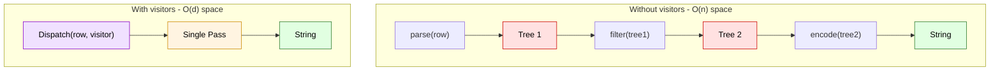
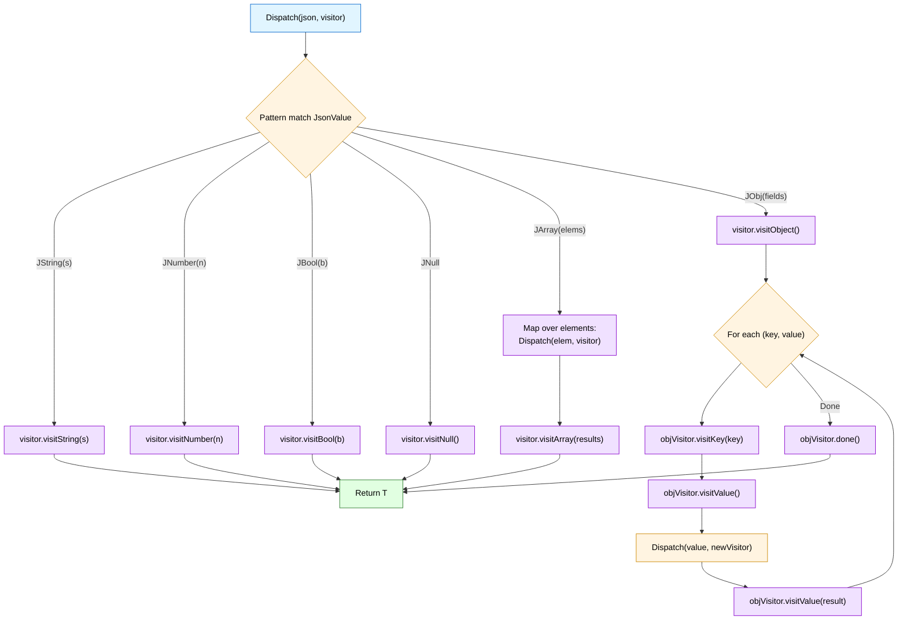
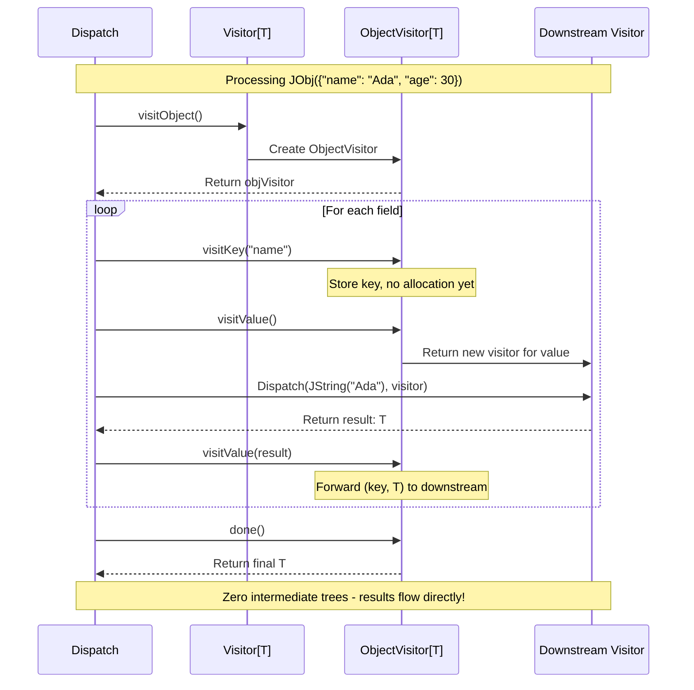

# Contributing to toon4s

Thanks for your interest. This covers how to build, test, benchmark, and the gates a change must pass.

## Development & quality gates

```bash
sbt scalafmtCheckAll   # formatting
sbt +test              # Scala 2.13 and 3.3 suites
./smoke-tests/run-smoke.sh
```

Releases are fully automated, but you must complete the prerequisites in
[`docs/releasing.md`](docs/internals/releasing.md) (namespace approval + PGP key upload)
before the GitHub Actions workflows can publish to Maven Central.

GitHub actions runs:

1. **Quick checks**: scalafmt + `+compile` on Ubuntu.
2. **Matrix tests**: Linux/macOS/Windows × Scala 2.13 & 3.3, with test-report artifacts when a shard fails.
3. **Spark compatibility**: `sparkIntegration/test` on Spark 3.5.0 and 4.0.1 (runs in parallel).
4. **Smoke**: CLI round trip script on Ubuntu.
5. **All checks pass** “gate” job.

### Performance (JMH)

- Quick run (single iteration, small windows):

```
sbt "jmh/jmh:run -i 1 -wi 1 -r 500ms -w 500ms -f1 -t1 io.toonformat.toon4s.jmh.EncodeDecodeBench.*"
```

- Typical run:

```
sbt "jmh/jmh:run -i 5 -wi 5 -f1 -t1 io.toonformat.toon4s.jmh.EncodeDecodeBench.*"
```

Or use aliases:

```
sbt jmhDev   # quick check
sbt jmhFull  # heavy run
```

#### Benchmarks methodology

- Intent: publish indicative throughput numbers for common shapes (tabular, lists, nested objects) under reproducible
  settings.
- Harness: JMH via `sbt-jmh` 0.4.5. Single thread (`-t1`), single fork (`-f1`).
- Quick config: `-i 1 -wi 1 -r 500ms -w 500ms` (fast sanity; noisy but useful for local checks).
- Heavy config: `-i 5 -wi 5 -r 2s -w 2s` (more stable). CI runs this set with a soft 150s guard.
- Reporting: CI also emits JSON (`-rf json -rff /tmp/jmh.json`) and posts a summary table on PRs.
- Machine baseline (indicative): macOS Apple M‑series (M2/M3), Temurin Java 21, default power settings.
- Guidance: close heavy apps/IDEs, plug in AC power, warm JVM before measurement. Numbers vary by OS/JVM/data
  shapes-treat them as relative, not absolute.

### Zero-overhead visitor pattern (v0.2.0+)

For Apache Spark-style workloads processing millions of rows, toon4s provides a **composable visitor pattern** that
eliminates intermediate allocations:

```scala
import io.toonformat.toon4s.visitor._

// Compose: Repair LLM output → Filter sensitive keys → Encode
val visitor = new JsonRepairVisitor(
  new FilterKeysVisitor(
    Set("password", "ssn", "api_key"),
    new StringifyVisitor(indent = 2)
  )
)

// Single pass, zero intermediate trees
val cleanToon: String = Dispatch(llmJson, visitor)
```

**Visitor composition flow:**

```mermaid
flowchart LR
    JSON["JsonValue Tree"] --> DISPATCH["Dispatch"]
    DISPATCH --> REPAIR["JsonRepairVisitor"]
    REPAIR --> FILTER["FilterKeysVisitor"]
    FILTER --> STRINGIFY["StringifyVisitor"]
    STRINGIFY --> OUTPUT["TOON String"]
    style JSON fill:#e1f5ff,stroke:#0066cc,color:#000
    style DISPATCH fill:#fff4e1,stroke:#cc8800,color:#000
    style REPAIR fill:#f0e1ff,stroke:#8800cc,color:#000
    style FILTER fill:#f0e1ff,stroke:#8800cc,color:#000
    style STRINGIFY fill:#f0e1ff,stroke:#8800cc,color:#000
    style OUTPUT fill:#e1ffe1,stroke:#2d7a2d,color:#000
```



**Performance comparison:**



**Dispatch algorithm (how visitor traversal works):**



**ObjectVisitor lifecycle (zero-overhead secret):**



**Key visitors:**

- `StringifyVisitor` - Terminal visitor producing TOON strings
- `ConstructionVisitor` - Terminal visitor reconstructing JsonValue trees
- `FilterKeysVisitor` - Intermediate visitor removing sensitive fields
- `JsonRepairVisitor` - Fixes malformed LLM JSON (converts string "true" → JBool, normalizes keys, etc.)
- `StreamingEncoder` - Streams directly to Writer for large datasets
- `TreeWalker[T]` - Universal adapter for encoding from Jackson JsonNode, Circe Json, Play JSON, etc. without JsonValue
  conversion
- `TreeConstructionVisitor[T]` - Universal adapter for decoding to Jackson JsonNode, Circe Json, etc. without JsonValue
  intermediate
- `VisitorConverter[T]` - Typeclass for converting domain models to JsonValue with `.toJsonValue` syntax

**Performance:** O(n) time, O(d) space where d = depth. Perfect for processing millions of rows with constant memory.

**Jackson/Circe interop (zero-overhead, typeclass pattern):**

```scala
import io.toonformat.toon4s.visitor.TreeWalkerOps._

// Setup: copy JacksonWalker adapter from TreeWalker scaladocs
implicit val walker: TreeWalker[JsonNode] = JacksonWalker

// Encode: Jackson JsonNode → TOON (zero JsonValue intermediate)
val jacksonNode: JsonNode = objectMapper.readTree(apiResponse)
val toon: String = jacksonNode.toToon(indent = 2)
val filtered: String = jacksonNode.toToonFiltered(Set("password"), indent = 2)

// Decode: TOON → Jackson JsonNode (zero JsonValue intermediate)
val factory = JsonNodeFactory.instance
val jacksonNode: JsonNode = Toon.decode(toonString)
  .map(Dispatch(_, JacksonConstructionVisitor(factory)))
  .fold(throw _, identity)
```

See `TreeWalker` and `TreeConstructionVisitor` scaladocs for complete Jackson/Circe adapter examples (copy-paste ready).

See also: `io.toonformat.toon4s.visitor` package docs
and [Li Haoyi's article](https://www.lihaoyi.com/post/ZeroOverheadTreeProcessingwiththeVisitorPattern.html).

### Streaming visitors

- Tabular rows only:

```scala
import io.toonformat.toon4s.decode.Streaming

val reader = new java.io.StringReader(
  """
users[2]{id,name}:
  1,Ada
  2,Bob
""".stripMargin)
Streaming.foreachTabular(reader) { (key, fields, values) =>
  // key = Some("users"), fields = List("id","name"), values = Vector("1","Ada") then Vector("2","Bob")
}
```

- Nested arrays with path:

```scala
val reader2 = new java.io.StringReader(
  """
orders[1]{id,items}:
  1001,[2]{sku,qty}:
    A1,2
    B2,1
""".stripMargin)
Streaming.foreachArrays(reader2)({ (path, header) =>
  // path: Vector("orders") when header key is bound
})({ (path, header, values) =>
  // values: Vector("A1","2"), then Vector("B2","1")
})
```

When to use streaming

- Validate/model‑check tabular sections quickly (row counts, required columns) without allocating a full AST.
- Pipe rows directly to sinks (CSV writers, database ingesters, online aggregation) for large payloads.
- Pre‑filter/transform rows on the fly before passing trimmed data to LLMs.
- Keep full `Toon.decode` for non‑tabular or when you need the entire tree (e.g., complex nested edits).

---

