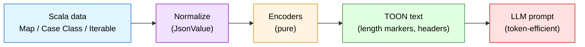
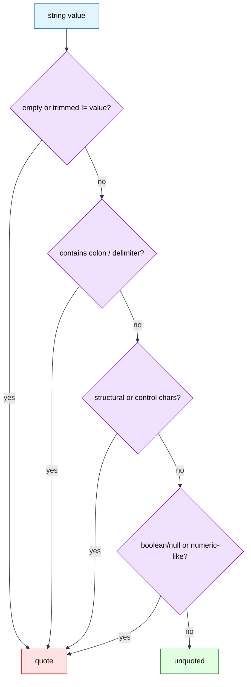
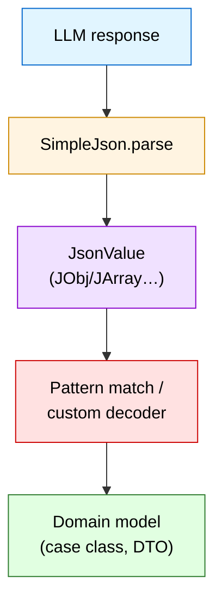

# toon4s · Token-Oriented Object Notation for Scala

[](https://github.com/vim89/toon4s/actions/workflows/ci.yml)
[](https://www.scala-lang.org/)
[](./LICENSE)

`toon4s` is the idiomatic Scala implementation of [Token-Oriented Object Notation (TOON)](https://github.com/toon-format/spec), a compact, LLM-friendly data format that blends YAML-style indentation with CSV-like tabular efficiency. The goal is simple: **ship JVM/Scala teams a production-grade TOON encoder/decoder with zero-runtime surprises, predictable types, and tooling that feels at home in the Scala ecosystem**.

> You write JSON or Scala data structures, convert the payload to TOON right before the LLM call, and pocket 30‑60% fewer tokens per request.

## Table of contents

- [Key features & Scala-first USPs](#key-features--scala-first-usps)
- [Benchmarks at a glance](#benchmarks-at-a-glance)
- [Installation](#installation)
- [Quick start (library)](#quick-start-library)
- [CLI usage](#cli-usage)
- [Format crash course](#format-crash-course)
- [Rules & guidelines](#rules--guidelines)
- [API surface](#api-surface)
- [Type safety & conversions](#type-safety--conversions)
- [Using TOON in LLM prompts](#using-toon-in-llm-prompts)
- [Limitations & gotchas](#limitations--gotchas)
- [Syntax cheatsheet](#syntax-cheatsheet)
- [Development & quality gates](#development--quality-gates)
- [License](#license)

---

## Key features & Scala-first USPs

| Theme | What you get | Why it matters on the JVM |
| ----- | ------------ | ------------------------- |
| **Spec-complete** | Passes the language-agnostic conformance suite copied from `toon-format/spec`. | Guarantees parity with TypeScript `toon` and Java `JToon`, so mixed stacks stay consistent. |
| **Pure functional core** | `Encoders`/`Decoders` are side-effect free, returning `Either[ToonError, *]`. | Slot nicely into Cats/ZIO pipelines or simple Futures without adapters. |
| **Sealed ADTs** | `JsonValue` (`JString`, `JNumber`, `JBool`, `JNull`, `JArray`, `JObj`) represents decoded trees with vector-backed determinism. | Enables exhaustive pattern matching, type-driven IDE help, and safe refactors. |
| **Automatic normalization** | `Normalize.toJson` ingests Scala collections, case classes (`Product`), Options, maps, arrays, Java time, etc. | No third-party JSON dependency; TOON output comes straight from your Scala data. |
| **Zero third-party deps (core)** | Only uses the standard library. CLI uses `scopt` + `jtokkit` for UX/token estimation. | Smaller jars, easier audit/compliance, faster cold starts on serverless/JVM. |
| **CLI parity** | `toon4s-cli` mirrors the TypeScript CLI (encode/decode, indent, delimiter, length markers, strict mode). | One binary for pipelines, CI smoke, or human conversions. |
| **Token introspection** | `TokenEstimator` (CLI) leverages `jtokkit` to preview GPT token counts before/after conversion. | Plan budgets, pick delimiters, and justify TOON adoption with data. |
| **LLM-friendly guardrails** | Explicit lengths, column headers, and strict validation (tabs, indentation, quoting). | Gives you deterministic prompts and enables server-side verification of model responses. |

See also: [Encoding rules](./SCALA-TOON-SPECIFICATION.md#encoding-rules), [Strict mode](./SCALA-TOON-SPECIFICATION.md#strict-mode-semantics), [Delimiters & markers](./SCALA-TOON-SPECIFICATION.md#delimiters--length-markers)

## Benchmarks at a glance

> Full numbers live in [`toon-format/spec`](https://github.com/toon-format/spec#benchmarks). Here’s the snapshot we care about when pitching this inside JVM teams.

```
Token counts vs formatted JSON (o200k_base tokenizer)

GitHub repos sample        ██████████████░░░░░░░░░░░    8,745 (TOON)
                           vs JSON:   15,145   💸 -42%
                           vs YAML:   13,129   💸 -33%
                           vs XML:    17,095   💸 -49%

Daily analytics feed       ██████████░░░░░░░░░░░░░░░    4,507 (TOON)
                           vs JSON:    9,234   💸 -51%
```

Savings depend on shape (uniform arrays shine, ragged JSON less so) but the takeaway is consistent: **TOON keeps JSON fidelity while cutting repeated keys and punctuation.**

See also: [Token benchmarks](./SCALA-TOON-SPECIFICATION.md#token-benchmarks)

---

## Installation

```scala
// build.sbt
libraryDependencies += "io.toonformat" %% "toon4s-core" % "0.1.0"
```

Prefer CLI only? Ship the staged script:

```bash
sbt cli/stage                            # builds ./cli/target/universal/stage/bin/toon4s-cli
./cli/target/universal/stage/bin/toon4s-cli --encode sample.json -o sample.toon
```

---

## Quick start (library)

```scala
import io.toonformat.toon4s._

val payload = Map(
  "users" -> Vector(
    Map("id" -> 1, "name" -> "Ada", "tags" -> Vector("reading", "gaming")),
    Map("id" -> 2, "name" -> "Bob", "tags" -> Vector("writing"))
  )
)

val toon = Toon.encode(payload, EncodeOptions(indent = 2)).fold(throw _, identity)
println(toon)
// users[2]{id,name,tags}:
//   1,Ada,[2]: reading,gaming
//   2,Bob,[1]: writing

val json = Toon.decode(toon).fold(throw _, identity)
println(json)
```

### JVM ergonomics

- Works with Scala 3.3.3 and Scala 2.13.14 (tested in CI).
- Accepts Scala collections, Java collections, `java.time.*`, `Option`, `Either`, `Product` (case classes, tuples), and `IterableOnce`.
- Deterministic ordering when encoding maps via `VectorMap`.

---

## CLI usage

```bash
# Encode JSON -> TOON with 4-space indentation and tab delimiters
toon4s-cli --encode data.json --indent 4 --delimiter tab -o data.toon

# Decode TOON -> JSON (strict mode on by default)
toon4s-cli --decode data.toon --strict true -o roundtrip.json
```

Available flags:

| Flag | Description |
| ---- | ----------- |
| `--encode` / `--decode` | Required: choose direction explicitly. |
| `--indent <n>` | Pretty-print indentation (default `2`). |
| `--delimiter <comma\|tab\|pipe>` | Column delimiter for tabular arrays. |
| `--length-marker` | Emit `[#N]` markers to disambiguate lengths in prompts. |
| `--strict <bool>` | Enforce indentation/escape rules when decoding. |
| `-o, --output <file>` | Target file (stdout when omitted). |

Note: token estimates are available via `TokenEstimator` in the codebase; the CLI will expose a flag in a future release.

---

## Format crash course

TOON borrows two big ideas:

1. **Indentation for structure** (like YAML)
2. **Headers for uniform arrays** (like CSV/TSV)



Example:

```
orders[2]{id,user,total,items}:
  1001,ada,29.70,[3]{sku,qty,price}:
                      A1,2,9.99
                      B2,1,5.50
                      C3,1,4.22
  1002,bob,15.00,[1]: gift-card
```

- `orders[2]` says “array length 2”. Optional `#` makes it `[#2]`.
- `{id,user,...}` declares columns for the following rows.
- Nested arrays either go inline (`[3]: gift-card,store-credit`) or open their own blocks.

Full spec reference: [toon-format/spec](https://github.com/toon-format/spec).

See also: [Encoding rules](./SCALA-TOON-SPECIFICATION.md#encoding-rules)

---

## Rules & guidelines

- **Strict indentation**: use spaces (tabs rejected when `strict=true`). Indent levels must be multiples of `DecodeOptions.indent`.
- **Quotes only when required**: strings with spaces, delimiters, or structural characters need `".."` wrapping.
- **Length markers**: recommended for LLM prompts; they let you validate response lengths quickly.
- **Delimiters**: choose comma (default), tab (token-efficient), or pipe (human-friendly). The delimiter is encoded in the header, so consumers know what to expect.
- **Uniform rows**: tabular arrays must have consistent field counts; strict mode enforces this.

Quoting vs. unquoted strings (encoder rules):

| Condition | Needs quotes? | Reason |
| --------- | -------------- | ------ |
| Empty string | Yes | Ambiguous if unquoted. |
| Leading/trailing whitespace | Yes | Preserves spaces. |
| Contains `:` | Yes | Conflicts with key separators. |
| Contains delimiter (`,`/`\t`/`|`) | Yes | Conflicts with row splitting. |
| Contains `"` or `\\` | Yes | Must be escaped inside quotes. |
| Contains `[ ] { }` | Yes | Structural tokens. |
| Contains `\n`, `\r`, `\t` | Yes | Control characters. |
| Starts with `-` at list depth | Yes | Could be parsed as list marker. |
| Boolean/Null literal: `true`/`false`/`null` | Yes | Avoids primitive coercion. |
| Looks numeric (e.g., `-12`, `1.2e5`, `01`) | Yes | Avoids numeric coercion; leading zeros are reserved. |



See also: [Encoding rules](./SCALA-TOON-SPECIFICATION.md#encoding-rules)

---

## API surface

| Package | Purpose |
| ------- | ------- |
| `io.toonformat.toon4s` | Core types: `Toon`, `JsonValue`, `EncodeOptions`, `DecodeOptions`, `Delimiter`. |
| `io.toonformat.toon4s.encode.*` | `Encoders`, primitive formatting helpers. |
| `io.toonformat.toon4s.decode.*` | `Decoders`, parser/validation utilities. |
| `io.toonformat.toon4s.json.SimpleJson` | Lightweight JSON AST + parser/stringifier used in tests/CLI. |
| `io.toonformat.toon4s.cli.*` | CLI wiring (`Main`, token estimator). |

Most teams only interact with `Toon.encode`, `Toon.decode`, and `JsonValue` pattern matching. Lower-level modules stay internal unless you are extending the format.

See also: [JsonValue ADT](./SCALA-TOON-SPECIFICATION.md#representation-jsonvalue-adt), [Encoding model](./SCALA-TOON-SPECIFICATION.md#encoding-model), [Decoding rules](./SCALA-TOON-SPECIFICATION.md#decoding-rules)

---

## Type safety & conversions

| Scala type | TOON behaviour |
| ---------- | -------------- |
| `String`, `Boolean`, `Byte/Short/Int/Long`, `Float/Double`, `BigDecimal` | Direct primitives; floats/ doubles silently drop `NaN/Inf` → `null` (to stay deterministic). |
| `Option[A]` | `Some(a)` → encode `a`; `None` → `null`. |
| `Either[L, R]` | Encoded as JSON-like objects (`{"Left": ...}`) via product encoding. Consider normalizing upstream. |
| `Iterable`, `Iterator`, `Array` | Encoded as TOON arrays, falling back to list syntax when not tabular. |
| `Map[String, _]`, `VectorMap` | Preserve insertion order; keys auto-quoted when needed. |
| `Product` (case classes / tuples) | Converted through `productElementNames` + `productIterator`. |
| `Java time` (`Instant`, `ZonedDateTime`, etc.) | ISO‑8601 strings, UTC-normalized for deterministic prompts. |

Decoding always yields the `JsonValue` ADT. To get back to Scala types, use `SimpleJson.toScala` (gives `Any`) or write pattern matches / Circe-like decoders over `JsonValue`.

See also: [Encoding model](./SCALA-TOON-SPECIFICATION.md#encoding-model), [JsonValue ADT](./SCALA-TOON-SPECIFICATION.md#representation-jsonvalue-adt)



---

## Using TOON in LLM prompts

**Prompt scaffolding idea:**

```
System: You are a precise data validator.
User:
Please read the following TOON payload describing purchase orders.
Return JSON with fields {id, total, status} for every order with total > 100.
Validate row counts against the markers.
```

Then attach:

```
orders[#3]{id,total,status}:
  101,250.10,pending
  102,89.00,fulfilled
  103,140.00,review
```

Why it helps:

- Length markers give you a checksum (“model must return 3 rows”).
- Tabular headers reduce hallucinations (model sees explicit columns).
- Reduced tokens = cheaper prompts; faster iteration = cheaper eval runs.

For response validation, decode the model output using `Toon.decode` (if the LLM responds in TOON) or rehydrate JSON responses and compare lengths/keys.

See also: [Delimiters & markers](./SCALA-TOON-SPECIFICATION.md#delimiters--length-markers), [Strict mode](./SCALA-TOON-SPECIFICATION.md#strict-mode-semantics)

---

## Limitations & gotchas

- **Irregular arrays**: when rows differ in shape, TOON falls back to YAML-like list syntax; token savings shrink.
- **Binary blobs**: not supported; encode as Base64 strings manually.
- **Streaming**: current implementation expects whole strings; for GB-scale payloads, chunk upstream.
- **Locale-specific numbers**: encoder always uses `.` decimal separators; ensure inputs are normalized beforehand.
- **CLI tokenizer**: `TokenEstimator` currently defaults to `CL100K_BASE` (GPT‑4/3.5). Model-specific differences apply.

---

## Syntax cheatsheet

| Construct | Example | Notes |
| --------- | ------- | ----- |
| Object | `user:\n  id: 123\n  name: Ada` | Indentation defines nesting. |
| Inline primitives | `tags[3]: reading,gaming,coding` | Quotes only when needed. |
| Tabular array | `users[2]{id,name}:\n  1,Ada\n  2,Bob` | Header defines columns. |
| Nested tabular | `orders[1]{id,items}:\n  1,[2]{sku,qty}: ...` | Inner header scoped to nested block. |
| Length marker | `items[#2|]{sku|qty}` | `#` emphasizes count; `|` encodes delimiter. |
| Empty array/object | `prefs[0]:` or `prefs: {}` | Choose whichever fits your schema. |
| Comments | *(not part of spec – strip before encoding)* | Keep prompts clean; TOON itself has no comment syntax. |

---

## Development & quality gates

```bash
sbt scalafmtCheckAll   # formatting
sbt +test              # Scala 2.13 and 3.3 suites
./smoke-tests/run-smoke.sh
```

GitHub Actions runs:

1. **Quick checks**: scalafmt + `+compile` on Ubuntu.
2. **Matrix tests**: Linux/macOS/Windows × Scala 2.13 & 3.3, with test-report artifacts when a shard fails.
3. **Smoke**: CLI round trip script on Ubuntu.
4. **All checks pass** “gate” job.

---

## License

MIT - see [LICENSE](./LICENSE).
