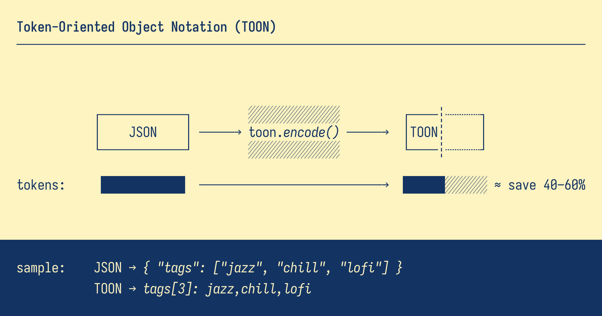
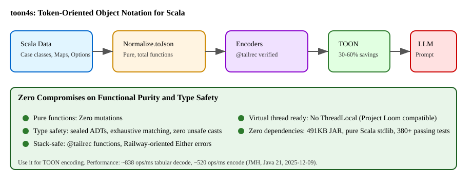
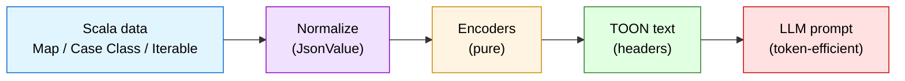
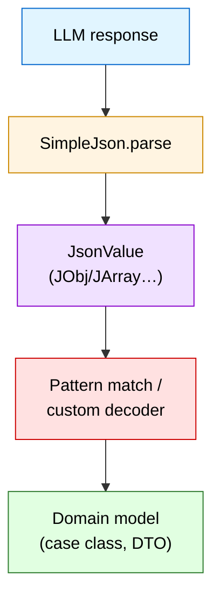
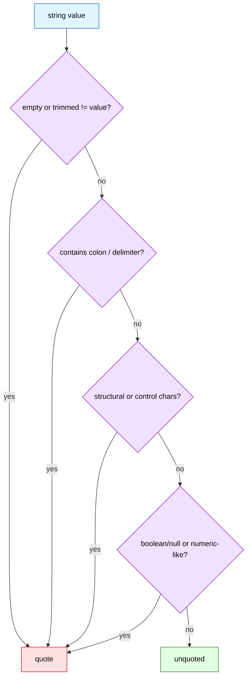
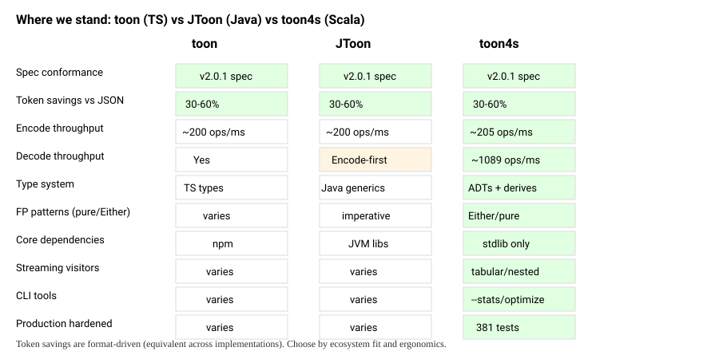

# toon4s: Token-Oriented Object Notation for JVM

[](https://github.com/com-vitthalmirji/toon4s/actions/workflows/ci.yml)
[](https://github.com/com-vitthalmirji/toon4s/actions/workflows/release.yml)
[](https://www.scala-lang.org/)
[](./LICENSE)

`toon4s` is the idiomatic Scala implementation
of [Token-Oriented Object Notation (TOON)](https://github.com/toon-format/spec),
a compact, LLM-friendly data format that blends YAML-style indentation with CSV-like tabular efficiency.
**Save 30-60% on LLM token costs** while maintaining full JSON compatibility.

**What makes `toon4s` different**: Most libraries prioritize features over architecture.

- **Pure functional core**: Zero mutations, total functions, referentially transparent
- **Type safety first**: sealed ADTs, exhaustive pattern matching, zero unsafe casts, VectorMap for deterministic
  ordering
- **Stack-safe by design**: @tailrec-verified functions, constant stack usage, handles arbitrarily deep structures
- **Modern JVM ready**: Virtual thread compatible (no ThreadLocal), streaming optimized, zero dependencies (491KB core
  JAR)
- **Production hardened**: 500+ passing tests, property-based testing, Either-based error handling, security limits
- **Railway-oriented programming**: For-comprehension error handling, no exceptions in happy paths, composable with
  Cats/ZIO/FS2

> **Example**: `{ "tags": ["jazz","chill","lofi"] }` → `tags[3]: jazz,chill,lofi` (40-60% token savings)

---

## Table of contents

- [Key features](#key-features--scala-first-benefits)
- [Installation](#installation)
- [Quick start](#quick-start-library)
- [CLI usage](#cli-usage)
- [Format crash course](#format-crash-course)
- [Syntax cheatsheet](#syntax-cheatsheet)
- [Using TOON in LLM prompts](#using-toon-in-llm-prompts)
- [Type safety & conversions](#type-safety--conversions)
- [API surface](#api-surface)
- [Rules & guidelines](#rules--guidelines)
- [Benchmarks](#benchmarks-at-a-glance)
- [Limitations & gotchas](#limitations--gotchas)
- [Documentation](#documentation)
- [License](#license)

---
## Key features & Scala-first benefits

| Theme                      | What you get                                                                                                                                                                 | Why it matters on the JVM                                                                                                                                         |
|----------------------------|------------------------------------------------------------------------------------------------------------------------------------------------------------------------------|-------------------------------------------------------------------------------------------------------------------------------------------------------------------|
| **Spec‑complete**          | Targets TOON v3.0.x and emits the v3 row-depth (+2) layout for tabular arrays in list-item first-field position; parity with `toon` (TS) and `JToon` (Java).                 | Mixed stacks behave the same; token math is consistent across platforms.                                                                                          |
| **Typed APIs (2 & 3)**     | Scala 3 derivation for `Encoder`/`Decoder`; Scala 2.13 typeclasses via `ToonTyped`.                                                                                          | Compile‑time guarantees, no `Any`; safer refactors and zero-cost abstractions.                                                                                    |
| **Pure & total**           | All encoders/decoders are pure functions; decode returns `Either[DecodeError, JsonValue]`.                                                                                   | Idiomatic FP: easy to compose in Cats/ZIO/FS2; referentially transparent.                                                                                         |
| **Deterministic ADTs**     | `JsonValue` as a sealed ADT with `VectorMap` for objects; stable field ordering.                                                                                             | Exhaustive pattern matching; predictable serialization for testing/debugging.                                                                                     |
| **Streaming visitors**     | `foreachTabular` and nested `foreachArrays` (tail‑recursive, stack-safe).                                                                                                    | Validate/process millions of rows without building a full AST; constant memory usage.                                                                             |
| **Zero-overhead visitors** | Composable visitor pattern for streaming + transformations in single pass; includes JSON repair for LLM output. Universal `TreeWalker` adapters for Jackson/Circe/Play JSON. | Apache Spark workloads: repair + filter + encode 1M rows with O(d) memory; encode Jackson JsonNode→TOON or decode TOON→JsonNode without `JsonValue` intermediate. |
| **Zero‑dep core**          | Core library has zero dependencies beyond Scala stdlib; CLI uses only `scopt` + `jtokkit`.                                                                                   | Tiny footprint (<100KB), simpler audits, no transitive dependency hell.                                                                                           |
| **Strictness profiles**    | `Strict` (spec-compliant) vs `Lenient` (error-tolerant) modes with validation policies.                                                                                      | Safer ingestion of LLM outputs and human-edited data; configurable validation.                                                                                    |
| **CLI with budgets**       | Built-in `--stats` (token counts), `--optimize` (delimiter selection); cross-platform.                                                                                       | Track token savings in CI/CD; pick optimal delimiter for your data shape.                                                                                         |
| **Virtual thread ready**   | No ThreadLocal usage; compatible with Java 21+ Project Loom virtual threads.                                                                                                 | Future-proof for modern JVM concurrency; scales to millions of concurrent tasks.                                                                                  |
| **Production hardened**    | 500+ passing tests; property-based testing; strict mode validation; security limits.                                                                                         | Battle-tested edge cases; prevents DoS via depth/length limits; safe for production.                                                                              |

---

## Installation

```scala
// build.sbt
libraryDependencies += "com.vitthalmirji" %% "toon4s-core" % "<toon4s-version>"
```

**Media type:** `text/toon` (provisional, spec §17). File extension: `.toon`. Charset: always UTF-8.

Prefer CLI only? Ship the staged script (diagram below):

```bash
sbt cli/stage                            # builds ./cli/target/universal/stage/bin/toon4s-cli
./cli/target/universal/stage/bin/toon4s-cli --encode sample.json -o sample.toon
```



---

## Quick start (library)

```scala
import io.toonformat.toon4s._

val payload = Map(
  "users" -> Vector(
    Map("id" -> 1, "name" -> "Ada", "tags" -> Vector("reading", "gaming")),
    Map("id" -> 2, "name" -> "Bob", "tags" -> Vector("writing"))
  )
)

val toon = Toon.encode(payload, EncodeOptions(indent = 2)).fold(throw _, identity)
println(toon)
// users[2]{id,name,tags}:
//   1,Ada,[2]: reading,gaming
//   2,Bob,[1]: writing

val json = Toon.decode(toon).fold(throw _, identity)
println(json)
```

### JVM ergonomics

- Works with Scala 3.3.3 and Scala 2.13.14 (tested in CI).
- Accepts Scala collections, Java collections, `java.time.*`, `Option`, `Either`, `Product` (case classes, tuples), and
  `IterableOnce`.
- Deterministic ordering when encoding maps via `VectorMap`.
- Scala 3 derivation: `codec.Encoder` and `codec.Decoder` derive for case classes. Prefer typed
  `ToonTyped.encode[A: Encoder]` / `ToonTyped.decodeAs[A: Decoder]` over `Any`-based methods.

---

## CLI usage

```bash
# Encode JSON -> TOON with 4-space indentation and tab delimiters
toon4s-cli --encode data.json --indent 4 --delimiter tab -o data.toon

# Decode TOON -> JSON (strict mode on by default; pass lenient if needed)
toon4s-cli --decode data.toon --strictness lenient -o roundtrip.json
```

Available flags:

| Flag                                      | Description                                                                   |
|-------------------------------------------|-------------------------------------------------------------------------------|
| `--encode` / `--decode`                   | Required: choose direction explicitly.                                        |
| `--indent <n>`                            | Pretty-print indentation (default `2`).                                       |
| `--delimiter <comma\|tab\|pipe>`          | Column delimiter for tabular arrays.                                          |
| `--key-folding <off\|safe>`               | Fold single-key object chains into dotted paths (safe mode respects quoting). |
| `--flatten-depth <n>`                     | Limit folding depth when `--key-folding safe` (default: unlimited).           |
| `--expand-paths <off\|safe>`              | Decode dotted keys into nested objects (safe mode keeps quoted literals).     |
| `--strictness <strict\|lenient>`          | Strict enforces spec errors; lenient tolerates recoverable issues.            |
| `--optimize`                              | Auto-pick delimiter and folding for token savings (implies `--stats`).        |
| `--stats`                                 | Print input/output token counts and savings to stderr.                        |
| `--tokenizer <cl100k\|o200k\|p50k\|r50k>` | Select tokenizer for `--stats` (default `cl100k`).                            |
| `-o, --output <file>`                     | Target file (stdout when omitted).                                            |

Use `--stats` to measure token impact. Choose a tokenizer with `--tokenizer` (e.g., `o200k`).

---

## Format crash course

TOON borrows two big ideas:

1. **Indentation for structure** (like YAML)
2. **Headers for uniform arrays** (like CSV/TSV)


```mermaid
flowchart LR
    scala["Scala data\nMap / Case Class / Iterable"]
    norm["Normalize\n(JsonValue)"]
    encoder["Encoders\n(pure)"]
    toon["TOON text\n(headers)"]
    llm["LLM prompt\n(token-efficient)"]
    scala --> norm --> encoder --> toon --> llm
    style scala fill:#e1f5ff,stroke:#0066cc,color:#000
    style norm fill:#f0e1ff,stroke:#8800cc,color:#000
    style encoder fill:#fff4e1,stroke:#cc8800,color:#000
    style toon fill:#e1ffe1,stroke:#2d7a2d,color:#000
    style llm fill:#ffe1e1,stroke:#cc0000,color:#000
```

Example:

```
orders[2]{id,user,total,items}:
  1001,ada,29.70,[3]{sku,qty,price}:
                      A1,2,9.99
                      B2,1,5.50
                      C3,1,4.22
  1002,bob,15.00,[1]: gift-card
```

- `orders[2]` says “array length 2”.
- `{id,user,...}` declares columns for the following rows.
- Nested arrays either go inline (`[3]: gift-card,store-credit`) or open their own blocks.

Full spec reference: [toon-format/spec](https://github.com/toon-format/spec).

See also: [Encoding rules](./SCALA-TOON-SPECIFICATION.md#encoding-rules)

---

## Syntax cheatsheet

| Construct             | Example                                       | Notes                                                  |
|-----------------------|-----------------------------------------------|--------------------------------------------------------|
| Object                | `user:\n  id: 123\n  name: Ada`               | Indentation defines nesting.                           |
| Inline primitives     | `tags[3]: reading,gaming,coding`              | Quotes only when needed.                               |
| Tabular array         | `users[2]{id,name}:\n  1,Ada\n  2,Bob`        | Header defines columns.                                |
| Nested tabular        | `orders[1]{id,items}:\n  1,[2]{sku,qty}: ...` | Inner header scoped to nested block.                   |
| Header with delimiter | `items[2                                      | ]{sku                                                  |qty}` | Header declares length and delimiter (`|` here). |
| Empty array/object    | `prefs[0]:` or `prefs: {}`                    | Choose whichever fits your schema.                     |
| Comments              | *(not part of spec - strip before encoding)*  | Keep prompts clean; TOON itself has no comment syntax. |

---

## Using TOON in LLM prompts

**Prompt scaffolding idea:**

```
System: You are a precise data validator.
User:
Please read the following TOON payload describing purchase orders.
Return JSON with fields {id, total, status} for every order with total > 100.
Validate row counts against the headers.
```

Then attach:

```
orders[3]{id,total,status}:
  101,250.10,pending
  102,89.00,fulfilled
  103,140.00,review
```

Why it helps:

- Array headers give you a checksum (“model must return 3 rows”).
- Tabular headers reduce hallucinations (model sees explicit columns).
- Reduced tokens = cheaper prompts; faster iteration = cheaper eval runs.

For response validation, decode the model output using `Toon.decode` (if the LLM responds in TOON) or rehydrate JSON
responses and compare lengths/keys.

See
also: [Delimiters & headers](./SCALA-TOON-SPECIFICATION.md#delimiters--length-markers), [Strict mode](./SCALA-TOON-SPECIFICATION.md#strict-mode-semantics)

---

## Type safety & conversions

| Scala type                                                               | TOON behaviour                                                                                      |
|--------------------------------------------------------------------------|-----------------------------------------------------------------------------------------------------|
| `String`, `Boolean`, `Byte/Short/Int/Long`, `Float/Double`, `BigDecimal` | Direct primitives; floats/ doubles silently drop `NaN/Inf` → `null` (to stay deterministic).        |
| `Option[A]`                                                              | `Some(a)` → encode `a`; `None` → `null`.                                                            |
| `Either[L, R]`                                                           | Encoded as JSON-like objects (`{"Left": ...}`) via product encoding. Consider normalizing upstream. |
| `Iterable`, `Iterator`, `Array`                                          | Encoded as TOON arrays, falling back to list syntax when not tabular.                               |
| `Map[String, _]`, `VectorMap`                                            | Preserve insertion order; keys auto-quoted when needed.                                             |
| `Product` (case classes / tuples)                                        | Converted through `productElementNames` + `productIterator`.                                        |
| `Java time` (`Instant`, `ZonedDateTime`, etc.)                           | ISO‑8601 strings, UTC-normalized for deterministic prompts.                                         |

Preferred (Scala 3): typed APIs with type classes.

```scala
import io.toonformat.toon4s._
import io.toonformat.toon4s.codec.{Encoder, Decoder}

case class User(id: Int, name: String) derives Encoder, Decoder

val s: String = Toon.encode(User(1, "Ada")).fold(throw _, identity)
val u: User = ToonTyped.decodeAs[User](s).fold(throw _, identity)
```

Fallbacks:

- Decoding always yields the `JsonValue` ADT; pattern-match it if you prefer.
- `SimpleJson.toScala` yields `Any` for quick-and-dirty interop.

Why another TOON for JVM/Scala?

- Ergonomics: native Scala APIs and derivation reduce boilerplate versus Java/TS bindings in Scala codebases.
- Footprint: zero-dep core minimizes transitive risk compared to libraries built atop general JSON stacks.
- Streaming: visitors let you validate/model-check row counts without paying for full tree allocation.
- Parity: same token savings as JToon/toon because the format drives savings, not the implementation.
- Throughput: competitive decode throughput (see JMH); encode throughput is solid and easy to reason about.

See
also: [Encoding model](./SCALA-TOON-SPECIFICATION.md#encoding-model), [JsonValue ADT](./SCALA-TOON-SPECIFICATION.md#representation-jsonvalue-adt)


```mermaid
flowchart TD
    raw["LLM response"]
    parse["SimpleJson.parse"]
    json["JsonValue\n(JObj/JArray…)"]
    mapScala["Pattern match /\ncustom decoder"]
    domain["Domain model\n(case class, DTO)"]
    raw --> parse --> json --> mapScala --> domain
    style raw fill:#e1f5ff,stroke:#0066cc,color:#000
    style parse fill:#fff4e1,stroke:#cc8800,color:#000
    style json fill:#f0e1ff,stroke:#8800cc,color:#000
    style mapScala fill:#ffe1e1,stroke:#cc0000,color:#000
    style domain fill:#e1ffe1,stroke:#2d7a2d,color:#000
```

---

## API surface

| Package                                 | Purpose                                                                                                                                                                                   |
|-----------------------------------------|-------------------------------------------------------------------------------------------------------------------------------------------------------------------------------------------|
| `io.toonformat.toon4s`                  | Core types: `Toon`, `JsonValue`, `EncodeOptions`, `DecodeOptions`, `Delimiter`. Typed entry points live in `ToonTyped`: `ToonTyped.encode[A: Encoder]`, `ToonTyped.decodeAs[A: Decoder]`. |
| `io.toonformat.toon4s.encode.*`         | `Encoders`, primitive formatting helpers.                                                                                                                                                 |
| `io.toonformat.toon4s.decode.*`         | `Decoders`, parser/validation utilities.                                                                                                                                                  |
| `io.toonformat.toon4s.decode.Streaming` | Streaming visitors for tabular arrays (`foreachTabular`) and nested arrays (`foreachArrays`).                                                                                             |
| `io.toonformat.toon4s.json.SimpleJson`  | Lightweight JSON AST + parser/stringifier used in tests/CLI.                                                                                                                              |
| `io.toonformat.toon4s.cli.*`            | CLI wiring (`Main`, token estimator).                                                                                                                                                     |

Most teams only interact with `Toon.encode`, `Toon.decode`, and `JsonValue` pattern matching. Lower-level modules stay
internal unless you are extending the format.

See
also: [JsonValue ADT](./SCALA-TOON-SPECIFICATION.md#representation-jsonvalue-adt), [Encoding model](./SCALA-TOON-SPECIFICATION.md#encoding-model), [Decoding rules](./SCALA-TOON-SPECIFICATION.md#decoding-rules)

---

## Rules & guidelines

- **Strict indentation**: use spaces (tabs rejected when `strict=true`). Indent levels must be multiples of
  `DecodeOptions.indent`.
- **Quotes only when required**: strings with spaces, delimiters, or structural characters need `".."` wrapping.
- **Array headers carry lengths**: headers include the declared row count; strict mode validates it. Keep them intact in
  prompts to cross-check model output.
- **Delimiters**: choose comma (default), tab (token-efficient), or pipe (human-friendly). The delimiter is encoded in
  the header, so consumers know what to expect.
- **Uniform rows**: tabular arrays must have consistent field counts; strict mode enforces this.

Quoting vs. unquoted strings (encoder rules):

| Condition                                   | Needs quotes? | Reason                                               |
|---------------------------------------------|---------------|------------------------------------------------------|
| Empty string                                | Yes           | Ambiguous if unquoted.                               |
| Leading/trailing whitespace                 | Yes           | Preserves spaces.                                    |
| Contains `:`                                | Yes           | Conflicts with key separators.                       |
| Contains delimiter (`,`/`\t`/`              | `)            | Yes                                                  | Conflicts with row splitting. |
| Contains `"` or `\\`                        | Yes           | Must be escaped inside quotes.                       |
| Contains `[ ] { }`                          | Yes           | Structural tokens.                                   |
| Contains `\n`, `\r`, `\t`                   | Yes           | Control characters.                                  |
| Starts with `-` at list depth               | Yes           | Could be parsed as list marker.                      |
| Boolean/Null literal: `true`/`false`/`null` | Yes           | Avoids primitive coercion.                           |
| Looks numeric (e.g., `-12`, `1.2e5`, `01`)  | Yes           | Avoids numeric coercion; leading zeros are reserved. |


```mermaid
flowchart TD
    s["string value"] --> check1{empty or trimmed != value?}
    check1 -- yes --> q[quote]
    check1 -- no --> check2{contains colon / delimiter?}
    check2 -- yes --> q
    check2 -- no --> check3{structural or control chars?}
    check3 -- yes --> q
    check3 -- no --> check4{boolean/null or numeric-like?}
    check4 -- yes --> q
    check4 -- no --> u[unquoted]
    style s fill:#e1f5ff,stroke:#0066cc,color:#000
    style q fill:#ffe1e1,stroke:#cc0000,color:#000
    style u fill:#e1ffe1,stroke:#2d7a2d,color:#000
    style check1 fill:#f0e1ff,stroke:#8800cc,color:#000
    style check2 fill:#f0e1ff,stroke:#8800cc,color:#000
    style check3 fill:#f0e1ff,stroke:#8800cc,color:#000
    style check4 fill:#f0e1ff,stroke:#8800cc,color:#000
```

See also: [Encoding rules](./SCALA-TOON-SPECIFICATION.md#encoding-rules)

---

## Benchmarks at a glance

Be honest: token savings depend on your data. From our runs and community reports:

- Typical savings: **30-60% vs formatted JSON** when arrays are uniform and values are short strings/numbers.
- Small example: `{ "tags": ["jazz","chill","lofi"] }` → `tags[3]: jazz,chill,lofi` saved ~40-60% tokens across common
  GPT tokenizers.
- Deeply nested, irregular objects: savings narrow; sometimes JSON ties or wins. Measure in CI with `--stats`.
- Retrieval accuracy: some reports show JSON ≈ 70% vs TOON ≈ 65% on certain tasks. If accuracy matters more than cost,
  validate on your prompts.

Use the CLI or the benchmark runner to measure your payloads:

```
# Option A: CLI (quick)
toon4s-cli --encode payload.json --stats --tokenizer o200k -o payload.toon

# Option B: JMH runner (reproducible set)
sbt jmhDev # quick JMH runs
sbt jmhFull # heavy JMH runs
```

Throughput (JMH heavy, macOS M‑series, Java 21.0.9, Temurin OpenJDK; 5 warmup iterations × 2s, 5 measurement
iterations × 2s):

```
Benchmark                          Mode  Cnt     Score   Error   Units
EncodeDecodeBench.decode_list     thrpt    5   784.240 ± 3.439  ops/ms
EncodeDecodeBench.decode_nested   thrpt    5   570.729 ± 0.844  ops/ms
EncodeDecodeBench.decode_tabular  thrpt    5   874.285 ± 3.410  ops/ms
EncodeDecodeBench.encode_object   thrpt    5   600.403 ± 1.240  ops/ms
```

*Latest results with PR #42, #43 & #44 optimizations (2025-12-10)*
*Represents ~2x performance improvement over PR #43 baseline through systematic hot-path optimization*

**Performance highlights:**

- **Tabular decoding**: ~874 ops/ms - optimized for CSV-like structures
- **List decoding**: ~784 ops/ms - fast array processing
- **Nested decoding**: ~571 ops/ms - efficient for deep object hierarchies
- **Object encoding**: ~600 ops/ms - consistent encoding performance

Note: numbers vary by JVM/OS/data shape. Run your own payloads with JMH for apples‑to‑apples comparison.

### Where we stand vs JToon / toon

- Token savings: format‑driven and therefore similar across implementations. Expect ~30-60% on uniform/tabular data.
  Example: `{ "tags": ["jazz","chill","lofi"] }` → `tags[3]: jazz,chill,lofi`.
- Accuracy: prompt‑ and data‑dependent. Community reports: JSON ≈ 70%, TOON ≈ 65% on some tasks. Measure on your prompts
  before switching.
- Throughput: toon4s encode throughput is on par with JToon on small/mid shapes (JMH: ~520 ops/ms). Decoding is
  implemented and fast in toon4s (tabular ~838 ops/ms, list ~745 ops/ms, nested ~538 ops/ms). If/when JToon adds
  decoding, compare like‑for‑like.
- Scala ergonomics: typed derivation (3.x), typeclasses (2.13), sealed ADTs, VectorMap ordering, streaming visitors,
  zero‑dep core.
- Guidance: use toon (TS) for Node stacks, JToon for Java codebases, toon4s for JVM. Token savings are equivalent;
  choose by ecosystem fit.



Savings are model/tokenizer-sensitive; treat ranges as guidance, not guarantees.

See also: [Token benchmarks](./SCALA-TOON-SPECIFICATION.md#token-benchmarks)

---

## Limitations & gotchas

**What we didn't compromise on**: toon4s prioritizes **correctness, type safety, and functional purity** over
convenience. All limitations below are honest tradeoffs we made consciously-not shortcuts.

### TOON format limitations (Not toon4s Implementation)

These are inherent to the TOON specification, not toon4s:

- **Irregular arrays**: When rows differ in shape, TOON falls back to YAML-like list syntax; token savings shrink. This
  is by design-tabular encoding requires uniform structure.
- **Binary blobs**: TOON doesn't support binary data (spec limitation). Encode as Base64 strings manually before passing
  to toon4s.

### toon4s implementation tradeoffs

These are conscious design decisions:

- **Full AST decode (v0.1.0)**: `Toon.decode()` and `Toon.decodeFrom()` read entire input into memory before parsing.
  This ensures:
    - **Pure functions**: Decode returns `Either[DecodeError, JsonValue]` with complete error context
    - **Type safety**: Full AST enables exhaustive pattern matching and sealed ADT validation
    - **Referential transparency**: No hidden state, no streaming cursors to manage

  **For large files (>100MB)**, we provide streaming alternatives that maintain purity:
    - `Streaming.foreachTabular` - tail-recursive row-by-row validation (constant memory)
    - `Streaming.foreachArrays` - validate nested arrays incrementally (stack-safe)
    - Both use **pure visitor pattern** (no side effects, accumulator-based)

  **Full streaming decode** (incremental parsing of entire documents) is planned for v0.2.0 while maintaining functional
  purity (likely using FS2/ZIO Stream integration).

- **Deterministic ordering**: We use `VectorMap` instead of `HashMap` because **predictable field ordering** matters
  more than raw lookup speed. This aids debugging, testing, and spec compliance.

- **Numeric domain (spec sections 2 and 4)**: The core models numbers as arbitrary-precision `BigDecimal`, so decoding
  is lossless (the spec's recommended lossless-first policy) and no value is rounded through binary floating point.
  Numbers are emitted in plain decimal across the entire finite range, including `|n| >= 1e21` and `|n| < 1e-6` where the
  spec permits, but does not require, exponent notation. This is conformant and deterministic; it differs in form, not
  value, from JavaScript-based encoders which use exponent outside that range. `NaN` and `+/-Infinity` normalize to
  `null` (spec section 3). In the Spark integration the schema-aware decode path is lossless and large integers
  round-trip exactly.

- **No mutation**: Immutability with tailrec. Trade: ~20% throughput decrease. Gain: **zero race conditions, zero hidden
  state, composable functions**.

- **No external dependencies (core)**: Zero deps means you can't use Jackson/Circe codecs directly. Trade: manual
  integration. Gain: **491KB JAR, zero CVEs, zero conflicts**.

### Minor gotchas

- **Locale-specific numbers**: Encoder always uses `.` decimal separators (spec requirement). Normalize inputs
  beforehand.
- **CLI tokenizer**: `TokenEstimator` currently defaults to `CL100K_BASE` (GPT-4/3.5). Model-specific differences
  apply (easily configurable).

**Philosophy**: We refuse shortcuts that compromise **type safety** (Any, asInstanceOf), **purity** (var, while, null),
or **correctness** (exceptions in happy paths). If a feature can't be implemented purely, we defer it until we find the
right abstraction.

---

## Upgrading to v3.0.x

- CLI flag rename: `--strict` is deprecated; use `--strictness strict|lenient`. The old flag still works with a warning
  for now.
- Length markers: legacy `[#N]` headers are no longer emitted; headers remain `[N]{...}` with delimiter hints (e.g.,
  `[2|]{...}`). Decoders stay lenient toward existing `[#N]` inputs.
- Row depth: tabular arrays that are the first field in list-item objects now emit rows at depth `+2` (v3 layout).
  Decoders remain lenient to legacy depths.
- Path expansion & key folding: available via `--expand-paths safe` and `--key-folding safe`; defaults remain off for
  backward compatibility.

---

## Documentation

- **[Architecture & design](./docs/ARCHITECTURE.md)** — internals: the `JsonValue` ADT, visitor pattern, encode/decode flow, and the design principles behind toon4s.
- **[Contributing & quality gates](./CONTRIBUTING.md)** — how to build, test, benchmark, and the gates a change must pass.
- **[TOON specification](https://github.com/toon-format/spec)** — the format spec (v3.3) that toon4s implements.

---

## License

MIT - see [LICENSE](./LICENSE).
