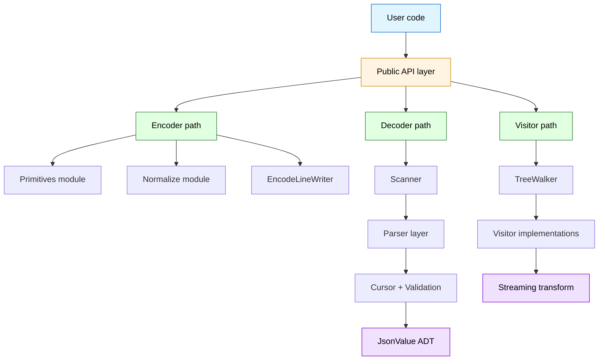
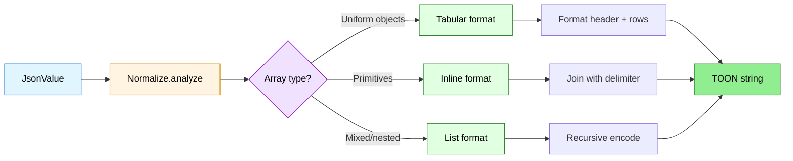
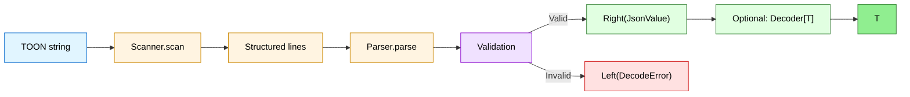
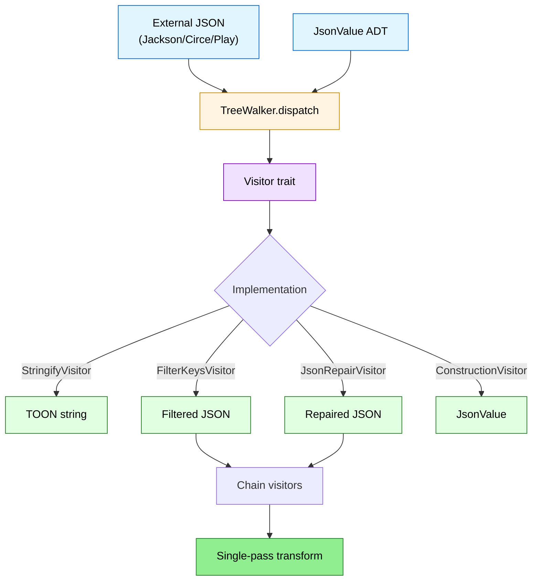
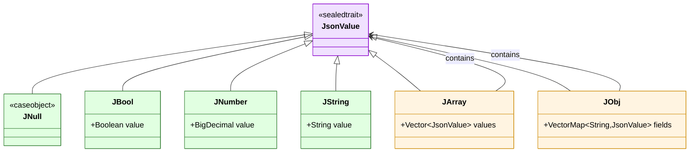
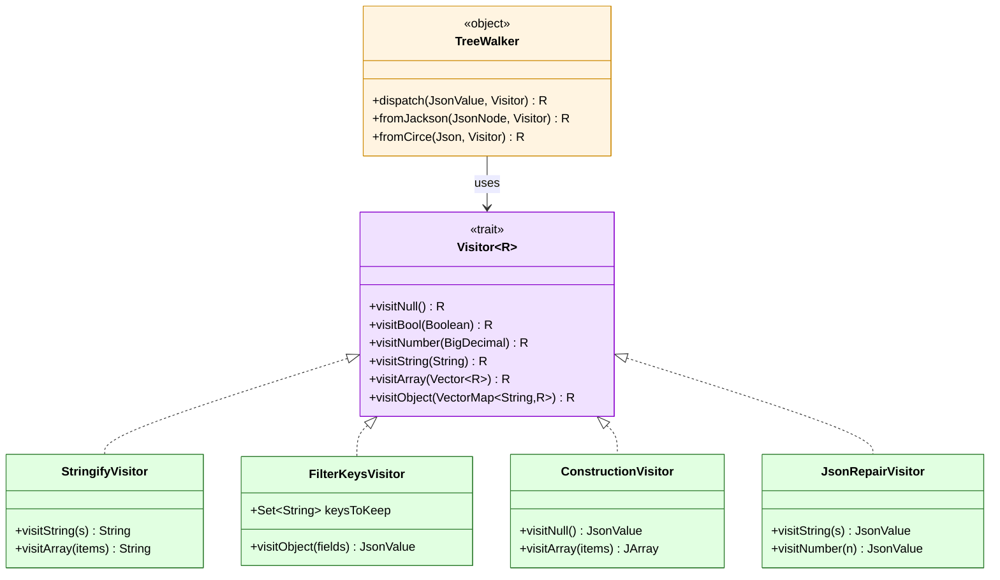
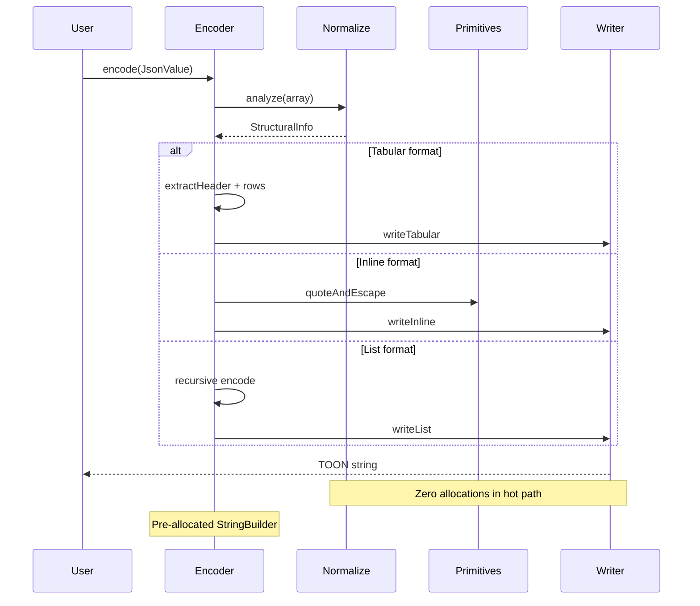
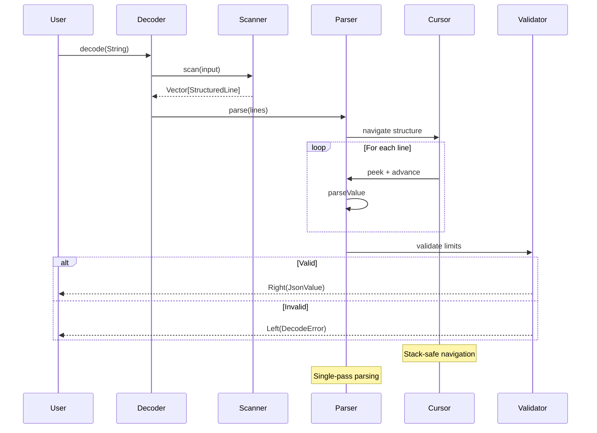
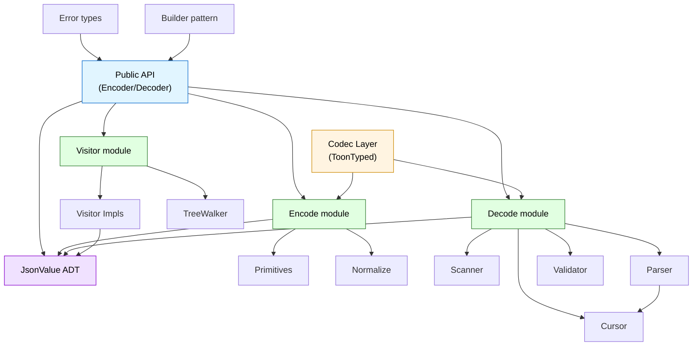

# toon4s architecture and design

Deep-dive internals for contributors and the curious. For getting started, see the [README](../README.md).

## Architecture & design

### High-level architecture

toon4s is built on a layered architecture that separates concerns and enables composability:



### Core modules

**Decode path** (`decode/`):

- **Scanner**: Tokenizes TOON text into structured lines with indentation tracking
- **Parser**: Converts tokens to `JsonValue` ADT with strict/lenient modes
- **Cursor**: Stack-safe navigation through nested structures
- **Validation**: Depth, length, and size limit enforcement

**Encode path** (`encode/`):

- **Encoders**: Pure functions from `JsonValue` to TOON format
- **Primitives**: Low-level string quoting and primitive encoding
- **Normalize**: Array/object structure analysis for optimal layout selection

**Visitor pattern** (`visitor/`):

- **TreeWalker**: Universal adapter for external JSON libraries (Jackson, Circe, Play)
- **Streaming Visitors**: O(1) memory transformations (filter, repair, stringify)
- **Composable**: Chain multiple visitors in single pass

### Encode flow



### Decode flow



### Visitor pattern flow



### Performance architecture

toon4s achieves **2x performance** through systematic optimization:

**Allocation reduction**:

- Pre-allocated `StringBuilder` capacity based on estimated output size
- Single-pass parsing (combined quote-finding + unescaping)
- Cached common header patterns (array lengths 0-10)
- `VectorBuilder` + while loops instead of functional chains

**Hot path optimization**:

- `Character.isWhitespace()` instead of `String.trim()` allocation
- Pattern matching for delimiter dispatch
- Early exit with `iterator.forall` for uniform array detection
- Hoisted constants outside loops

**Memory efficiency**:

- Streaming visitors with O(d) memory (depth-dependent, not size-dependent)
- Tail-recursive iteration for large arrays
- Stack-safe cursor navigation
- No intermediate allocations in visitor chains

**Benchmark results** (encode_object: 287 → 600 ops/ms, decode_tabular: 417 → 874 ops/ms):

- P0 quick wins: 20-30% gain
- P1 high impact: 45-70% gain
- P2 optimizations: 4-15% additional gain
- **Total: ~2x improvement** while maintaining functional purity

### JsonValue ADT hierarchy



### Visitor pattern architecture



### Encode sequence diagram



### Decode sequence diagram



### Module dependency diagram



---

## Design principles

**This is what sets toon4s apart**: While most libraries compromise on architecture for convenience, toon4s demonstrates
that you can have **both production performance and functional purity**. Every design decision prioritizes correctness,
composability, and type safety-making toon4s a reference implementation for modern Scala projects.

### Pure functional core

Every function in toon4s is **pure** and **total**:

- **Zero mutations**: No vars / while loops
    - State threading pattern (pass state as parameters, return new state)
    - Accumulator-based tail recursion
    - Immutable builders (Vector, VectorMap)

- **Total functions**: No exceptions in happy paths
    - All encoders/decoders return `Either[Error, Result]`
    - Railway-oriented programming for error handling
    - Exhaustive pattern matching on sealed ADTs

- **Referentially transparent**: Same input → same output, always
    - No side effects in core logic
    - No global mutable state
    - Deterministic output (VectorMap preserves insertion order)

- **Stack-safe recursion**: functions with `@tailrec`
    - Compiler-verified tail call optimization
    - Can parse arbitrarily deep structures
    - Constant stack usage regardless of input size

### Type safety guarantees

> Scala's type system is used to maximum effect

Key type safety features:

- **sealed ADTs**: Exhaustive pattern matching catches missing cases at compile time
- **No unsafe casts**: Zero `asInstanceOf` in production code (only 2 necessary casts with safety comments)
- **VectorMap everywhere**: Ensure deterministic field ordering
- **Compile-time derivation**: Scala 3 `derives` generates type class instances at compile time

### Design patterns in action

**State threading pattern**

```scala
@tailrec
def collectFields(
                   targetDepth: Option[Int],
                   acc: Vector[(String, JsonValue)] // Accumulator instead of var
                 ): Vector[(String, JsonValue)] = {
  cursor.peek match {
    case None => acc
    case Some(line) if line.depth < baseDepth => acc
    case Some(line) =>
      val td = targetDepth.orElse(Some(line.depth))
      if (td.contains(line.depth)) {
        cursor.advance()
        val KeyValueParse(key, value, _) = decodeKeyValue(.
      ..)
        collectFields(td, acc :+ (key -> value)) // Recurse with new state
      } else acc
  }
}
```

**Railway-oriented programming**

```scala
// Either accumulation instead of var err: Error | Null = null
xs.foldLeft[Either[DecodeError, List[A]]](Right(Nil)) {
  (acc, j) =>
    for
      list <- acc // Short-circuit on first error
      a <- d(j) // Decode current element
    yield a :: list // Accumulate successes
}.map(_.reverse)
```

**Visitor pattern for zero-overhead transformations**

```scala
// Generic visitor trait with type parameter R (return type)
trait Visitor[R] {
  def visitNull(): R

  def visitBool(value: Boolean): R

  def visitString(value: String): R

  def visitArray(items: Vector[R]): R

  def visitObject(fields: VectorMap[String, R]): R
}

// TreeWalker dispatches to visitor without intermediate allocations
object TreeWalker {
  def dispatch[R](json: JsonValue, visitor: Visitor[R]): R = json match {
    case JNull => visitor.visitNull()
    case JBool(b) => visitor.visitBool(b)
    case JArray(items) => visitor.visitArray(items.map(dispatch(_, visitor)))
    case JObj(fields) => visitor.visitObject(fields.map((k, v) => k -> dispatch(v, visitor)))
  }
}

// Compose multiple visitors in single pass
val filtered = TreeWalker.dispatch(json, FilterKeysVisitor(Set("id", "name")))
val repaired = TreeWalker.dispatch(filtered, JsonRepairVisitor())
```

**Strategy pattern for encoding**

```scala
// Different encoding strategies based on structure analysis
sealed trait EncodingStrategy

case object TabularStrategy extends EncodingStrategy

case object InlineStrategy extends EncodingStrategy

case object ListStrategy extends EncodingStrategy

// Normalize.analyze returns StructuralInfo with detected strategy
case class StructuralInfo(
                           strategy: EncodingStrategy,
                           commonFields: Option[List[String]],
                           isUniform: Boolean
                         )

// Encoder dispatches based on strategy
def encodeArray(arr: JArray): String = {
  val info = Normalize.analyze(arr)
  info.strategy match {
    case TabularStrategy => encodeTabular(arr, info.commonFields.get)
    case InlineStrategy => encodeInline(arr)
    case ListStrategy => encodeList(arr)
  }
}
```

**Builder pattern with phantom types**

```scala
// Type-safe builder using phantom types
sealed trait BuilderState

sealed trait Empty extends BuilderState

sealed trait WithDelimiter extends BuilderState

sealed trait Complete extends BuilderState

class OptionsBuilder[S <: BuilderState] private(config: Map[String, Any]) {
  // Only callable in Empty state
  def delimiter(d: Delimiter)(implicit ev: S =:= Empty): OptionsBuilder[WithDelimiter] =
    new OptionsBuilder(config + ("delimiter" -> d))

  // Only callable in WithDelimiter state
  def strictness(s: Strictness)(implicit ev: S =:= WithDelimiter): OptionsBuilder[Complete] =
    new OptionsBuilder(config + ("strictness" -> s))

  // Only callable in Complete state
  def build()(implicit ev: S =:= Complete): Options =
    Options(
      delimiter = config("delimiter").asInstanceOf[Delimiter],
      strictness = config("strictness").asInstanceOf[Strictness]
    )
}

// Usage (type-safe at compile time)
val opts = OptionsBuilder.empty
  .delimiter(Delimiter.Comma) // Must be first
  .strictness(Strictness.Strict) // Must be second
  .build() // Must be last
```

**Typeclass pattern for derivation**

```scala
// Encoder typeclass for type-safe serialization
trait Encoder[A] {
  def encode(value: A): JsonValue
}

// Decoder typeclass for type-safe deserialization
trait Decoder[A] {
  def decode(json: JsonValue): Either[DecodeError, A]
}

// Scala 3 automatic derivation
case class User(id: Int, name: String, email: String) derives Encoder, Decoder

// Usage (type-safe at compile time)
val user = User(1, "Alice", "alice@example.com")
val json = Encoder[User].encode(user) // JsonValue
val decoded = Decoder[User].decode(json) // Either[DecodeError, User]
```

**Adapter pattern for external libraries**

```scala
// TreeWalker adapts external JSON libraries without conversion
object TreeWalker {
  // Jackson adapter
  def fromJackson[R](node: JsonNode, visitor: Visitor[R]): R = {
    if (node.isNull) visitor.visitNull()
    else if (node.isBoolean) visitor.visitBool(node.booleanValue())
    else if (node.isArray) {
      val items = node.elements().asScala.map(fromJackson(_, visitor)).toVector
      visitor.visitArray(items)
    }
    // ... dispatch to visitor directly without creating JsonValue
  }

  // Circe adapter
  def fromCirce[R](json: io.circe.Json, visitor: Visitor[R]): R = {
    json.fold(
      visitor.visitNull(),
      visitor.visitBool,
      n => visitor.visitNumber(BigDecimal(n.toString)),
      visitor.visitString,
      arr => visitor.visitArray(arr.map(fromCirce(_, visitor)).toVector),
      obj => visitor.visitObject(VectorMap.from(obj.toMap.map((k, v) => k -> fromCirce(v, visitor))))
    )
  }
}

// Usage: zero-copy transformation from Jackson to TOON
val jacksonNode: JsonNode = objectMapper.readTree(input)
val toonString = TreeWalker.fromJackson(jacksonNode, StringifyVisitor(Options.default))
```

**Factory pattern for parser creation**

```scala
// Parser factory with configuration
object Parser {
  def create(options: Options): Parser = {
    val validator = Validator(
      maxDepth = options.maxDepth,
      maxLength = options.maxLength,
      maxSize = options.maxSize
    )

    new Parser(
      strictness = options.strictness,
      validator = validator,
      delimiter = options.delimiter
    )
  }
}
```

### Code quality metrics

| Metric                 | Value                    | Meaning                  |
|------------------------|--------------------------|--------------------------|
| **Production code**    | 5,887 lines (56 files)   | Well-organized, modular  |
| **Test coverage**      | 500+ tests, 100% passing | Comprehensive validation |
| **Tail-recursive fns** | With `@tailrec`          | Stack-safe, verified     |
| **Sealed ADTs**        | traits/classes           | Exhaustive matching      |
| **VectorMap usage**    | 32+ occurrences          | Deterministic ordering   |
| **Mutable state**      | **No `vars` in parsers** | Pure functional          |
| **Unsafe casts**       | 2 (documented as safe)   | Type-safe design         |

### Modern JVM architecture

Built for the future of JVM concurrency:

- **Virtual thread ready**: Zero `ThreadLocal` usage
    - Fully compatible with Java 21+ Project Loom
    - Can spawn millions of virtual threads without memory leaks
    - See core/src/main/scala/io/toonformat/toon4s/encode/Primitives.scala:60 for virtual thread design notes

- **Streaming optimized**: Constant-memory validation
    - `Streaming.foreachTabular` - process rows without full AST
    - `Streaming.foreachArrays` - validate nested arrays incrementally
    - Tail-recursive visitors with accumulator pattern

- **Zero dependencies**: 491KB core JAR
    - Pure Scala stdlib (no Jackson, Circe, Play JSON)
    - CLI only adds scopt + jtokkit
    - Minimal attack surface for security audits

### Zero compromises philosophy

toon4s proves you don't have to choose between **performance** and **purity**:

| Traditional tradeoff         | How toon4s achieves both                                                                |
|------------------------------|-----------------------------------------------------------------------------------------|
| "Mutation is faster"         | **Tail recursion + accumulators** match imperative performance while staying pure       |
| "Exceptions are simpler"     | **Either + railway-oriented programming** is just as ergonomic with for-comprehensions  |
| "ThreadLocal is convenient"  | **State threading pattern** works seamlessly with virtual threads (future-proof)        |
| "Any/casting saves time"     | **Sealed ADTs + exhaustive matching** catch bugs at compile time (saves debugging time) |
| "External libs add features" | **Zero dependencies** means zero CVEs, zero conflicts, minimal attack surface           |

**The result**: A library that's both **safer** (pure FP, types) and **faster to maintain** (no surprises, composable).

This architecture makes toon4s ideal for:

- **Production services** - reliability and correctness are non-negotiable
- **Functional stacks** (Cats, ZIO, FS2) - pure functions compose without side effects
- **Virtual thread workloads** (Project Loom) - no ThreadLocal means no memory leaks
- **High-throughput pipelines** - ~660 ops/ms average with predictable, constant-memory streaming
- **Type-safe domain modeling** - sealed ADTs + derivation = compile-time guarantees

**Bottom line**: toon4s is what happens when you refuse to compromise. Use it for TOON encoding, or study it to learn
how to build production-grade functional systems.

See also: [SCALA-TOON-SPECIFICATION.md](./SCALA-TOON-SPECIFICATION.md) for encoding rules

---


See
also: [Encoding rules](./SCALA-TOON-SPECIFICATION.md#encoding-rules), [Strict mode](./SCALA-TOON-SPECIFICATION.md#strict-mode-semantics), [Delimiters & headers](./SCALA-TOON-SPECIFICATION.md#delimiters--length-markers)

